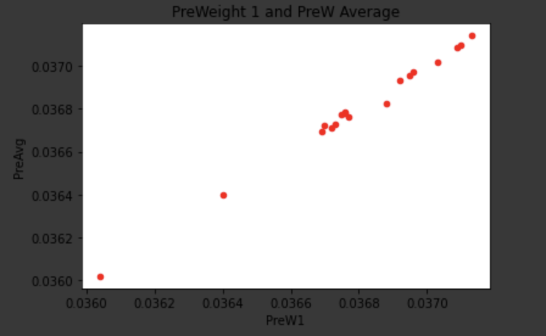
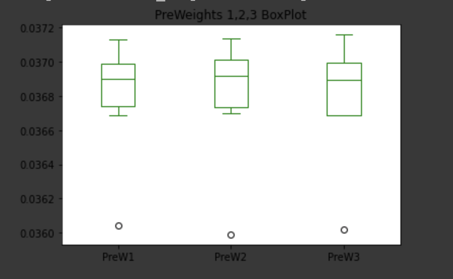
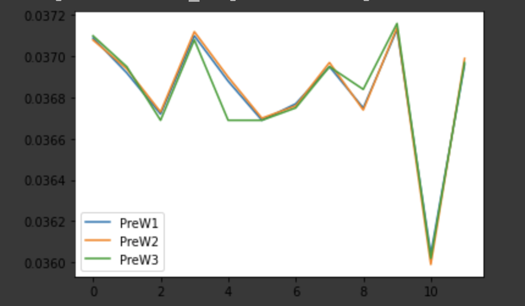
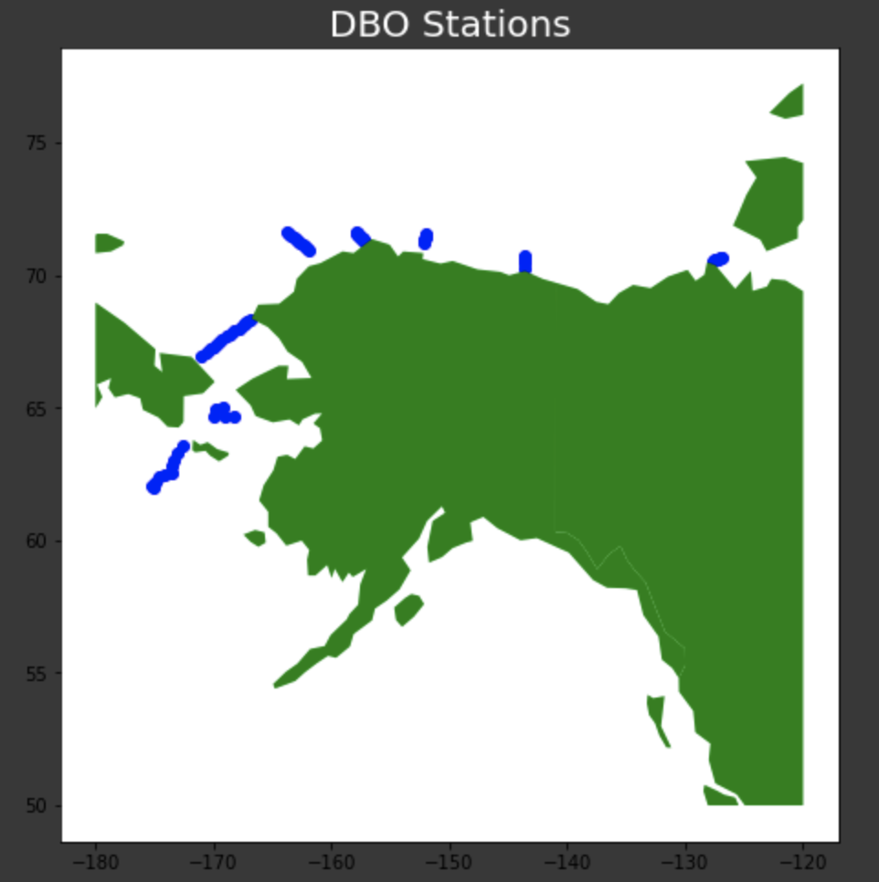

# (Geo)Pandas Tutorial
A quick tutorial for the python libraries pandas and geopandas 🐼
Created by Sophie Spiliotopoulos for IDCE 30274, Nov 2020

### Data 
Data for this tutorial can be found in the `data` folder of the repo. This data includes mean sea ice concentration (SIC) data from the NSIDC and suspended particualte matter (SPM) data that was collected and created as a part of the Distributed Biological Observatory (DBO) project. You can learn more about the DBO [here](https://dbo.cbl.umces.edu) 

# Part 1: Getting Started 
Let's start by importing all the main libraries we'll need
```python
#install geopandas
!pip install geopandas 
#import libraries and give them aliases
import pandas as pd
import geopandas as gpd
```
I used Google Drive to store my data, so here I set up my drive. The data for this tutorial is in the `data`. 
```python 
from google.colab import drive 
drive.mount('/content/gdrive') 
# set root path
root_path = 'gdrive/My Drive/(geo)pandas_tutorial_final/' 
```
Now that Google Drive is set up, we'll bring in the first two datasets, a mean SIC for 1980-2010 and SPM data collected in the Pacific Arctic in 2019. 
```python 
#import .csv and call the data 
spm19 = pd.read_csv(root_path+"spm19_proc_blanks.csv")
mean_sic = pd.read_csv(root_path+"1981-2010_SIC_Daily.csv")
```
Alternately, we could create a database here within the script using something along the lines of: 
```python 
#Create a dictionary of a database 
dict = {"country": ["Brazil", "Russia", "India", "China", "South Africa"],
       "capital": ["Brasilia", "Moscow", "New Dehli", "Beijing", "Pretoria"],
       "area": [8.516, 17.10, 3.286, 9.597, 1.221],
       "population": [200.4, 143.5, 1252, 1357, 52.98] }

#print out tab data 
brics = pd.DataFrame(dict)
print(brics)
```
# Part 2: Reading Files with Pandas
The next few lines of code are testing out different way to read and your data files. 
```python
#call the first 4 rows
#use .head() to start from the beginning of the data, use .tail() to start at the end 
spm19.head(4)

#check data types for all columns 
spm19.dtypes 

#find more detailed info on the data 
spm19.info()

#descriptive statistics of data frame 
spm19.describe()
#to call a specific column
spm19["Pre-Weight 1"].describe()
```
FYI: `loc` and `iloc` are two useful functions for calling parts of your data. The difference between the two is:
`loc`needs the name of the row and the column to be filtered
`iloc` is index based, so it just needs the index (using integer indexes)

# Part 3: Manipulating the Data
The great thing about `pandas` is that you can maniuplate your `.csv` or other file from within your code. Here are a few different ways to select things, run statistics, change names, etc. 
```python
#select a column
spm19["Pre-Weight 1"]

#select a column and run a stat
spm19["Pre-Weight 1"].sum #OR TRY .median(), .mean(), .mode(), .nunique() for numner of unique entries, .max(), .min()

#select multiple columns 
spm19[["Pre-Weight 1","Post Weight 1"]]

#renaming columns by creating a dictionary 
#using inplace to change dataframe without an assignment
spm19.rename(columns = {"Pre-Weight 1": "PreW1","Pre Weight 2":"PreW2","Pre-Weight 3": "PreW3","Average":"PreAvg","Post Weight 1": "PostW1","Post Weight 2": "PostW2","Post Weight 3": "PostW3","Post-Average":"PostAvg"},inplace = True)
spm19.head()
```
if you columns you don't want, you can delete them using `.drop`
```python
#get rid of sample standard deviation data, we don't need it for this 
#df.drop(df.iloc[:, 1:3], inplace = True, axis = 1) 
mean_sic.drop(mean_sic.iloc[:,2:18:2], inplace= True, axis =1)
#see what you did 
mean_sic
```
# Part 4: Making Some Plots! 
You can make scatter plots, box plots, bar graphs, etc. using pandas to visualize your data 
### Scatter Plot
```python 
#scatter plot! 
spm19.plot.scatter(x = "PreW1", y = "PreAvg", c = 'red', title = 'Pre Weight 1 and PreW Average') 
# x for x parameter , y for y parameter,  c for color of point 
```

### Box Plot
```python
#box plot!
#create a subset of the data uisng iloc and selecting on the the three pre-weight columns
preweights = spm19.iloc[ :12,4:7]
preweights.plot.box(color = 'green', title = 'PreWeights 1,2,3 BoxPlot')
```

### Line Plot
```python
preweights.plot.line()
```


# Part 5: Pandas, but make it Geospatial
First, we need to install a few new libraries: 
```python
!pip install geopandas
import geopandas as gpd
import matplotlib.pyplot as plt
from shapely.geometry import Polygon
from shapely.geometry import Polygon, LineString
!apt install libspatialindex-dev
!pip install rtree
import rtree
```
Now, let's bring in the spatial data. I'll be using DBO station point data 

```
#import polygon data as north polar stereographic and point data 
dbo = gpd.read_file(root_path+'DBOsites_erased_land.shp', crs = {'init' :'epsg:3413'})
dbopoint = gpd.read_file(root_path+'dbo1_8_projet.shp', crs = {'init' :'epsg:3476'})
#reproject into wgs 84
dbopoint = dbopoint.to_crs('epsg:4326')
dbo = dbo.to_crs('epsg:4326')
```
Now lets get a basemap ready 
```python
#get world layer 
world = gpd.read_file(gpd.datasets.get_path('naturalearth_lowres'))
#create polygon to clip to 
poly = Polygon([(-180, 50), (-180, 80), (-120, 80), (-120, 50)])
polygon = gpd.GeoDataFrame([1], geometry=[poly], crs=world.crs)
#clip world to polygon 
clipped = gpd.clip(world, polygon)
fig, ax = plt.subplots(figsize=(12,10))
clipped.plot(ax=ax, color='gray')
```


Now add the DBO point data
```python
#make the plot
fig, ax = plt.subplots(figsize=(12, 8))
dbopoint.plot(ax=ax, color="blue")
clipped.plot(ax=ax, color="green")
ax.set_title("DBO Stations", fontsize=20)
plt.show()
```

